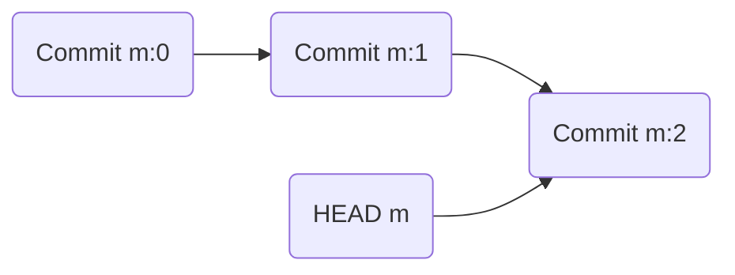
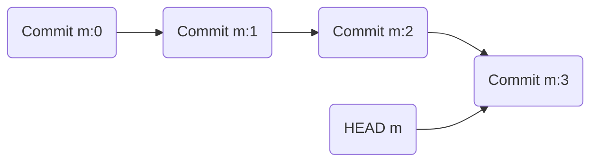
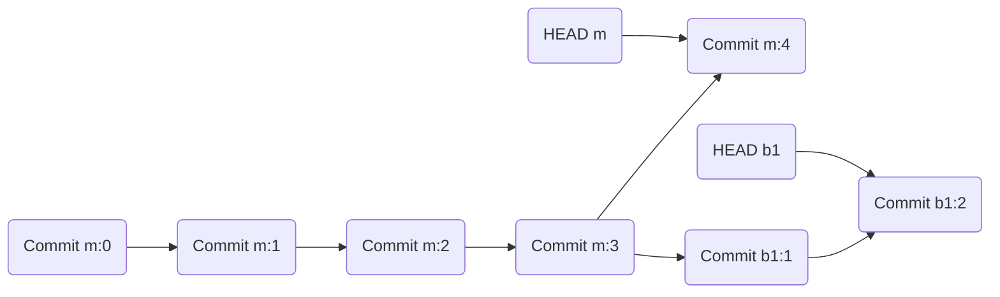
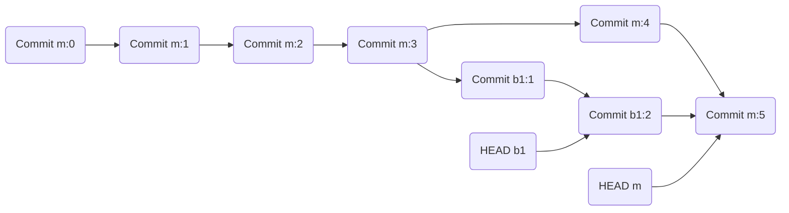
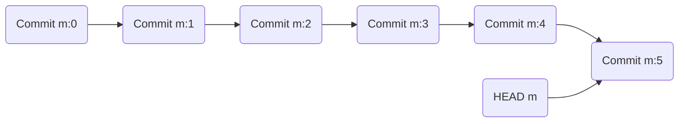

This repo is just to contain a few diagrams

A repo after a few commits. HEAD points at last commit.

Adding one more commit updates HEAD to point at latest

Branching from main:HEAD

Merging from HEAD b1 to main

After removing branch 1

