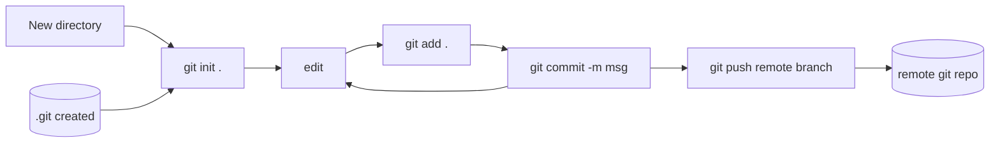

```mermaid
  flowchart LR;
    A[New directory]-->B[git init .];
    R1[(.git created)]-->B;
    B-->C[edit];
    C-->D[git add .];
    D-->E[git commit -m msg];
    E-->C;
    E-->G[git push remote branch];
    G-->R2[(remote git repo)];
```
