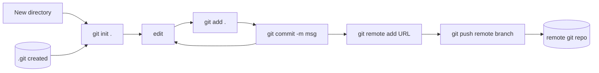

Normal workflow is either to clone an existing repo, do work, then pull + push to remote.
Missing in diagram below is adding the remote to the new local repo.)

Git can be used to sync with two different remotes, using pull/fetch and push.
Branches can also be used to track work done on each end.

